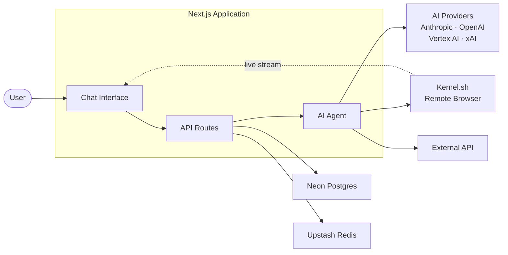
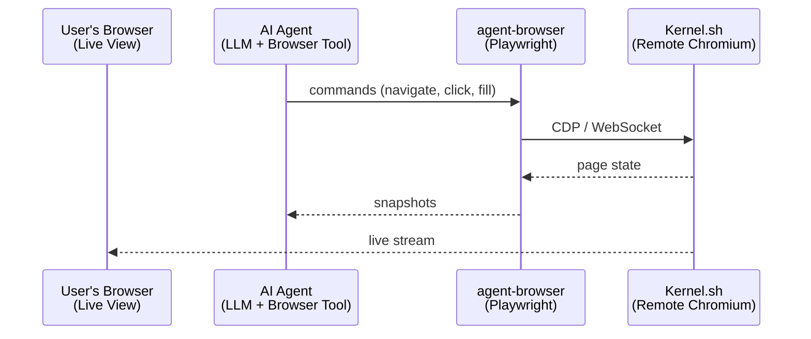

# Form-Filling Assistant

**An open-source AI tool that helps caseworkers navigate benefit portals and complete applications on behalf of clients.**

Built by [Nava Labs](https://www.navapbc.com/labs/ai-tools-public-benefits), a division of [Nava PBC](https://www.navapbc.com).

**[About](#about)** · **[Features](#features)** · **[Architecture](#architecture)** · **[Getting Started](#getting-started)** · **[Contributing](#contributing)** · **[License](#license)**

---

## About

Benefit navigators and caseworkers spend significant time manually searching multiple databases, navigating benefit portals, and filling out application forms on behalf of the families they serve. This tool uses generative AI to automate that repetitive, time-consuming work — so caseworkers can focus on the people in front of them.

The [Form-Filling Assistant](https://www.navapbc.com/labs/caseworker-ai-tools/form-filling-assistant) is a  part of Nava Labs' broader [Caseworker Empowerment Toolkit](https://www.navapbc.com/labs/caseworker-ai-tools).


**Who this is for:**

- **Caseworkers and benefit navigators** who help clients enroll in public benefit programs
- **Government agencies and social services organizations** developing AI tools for their workforce
- **Developers** looking to build or adapt AI-assisted casework tools for their context

---

## Features

- **Agentic form-filling** — autonomously navigates benefit portals and populates application forms based on client information
- **Database lookup** — searches within databases to surface relevant client information
- **Caseworker oversight** — all actions are reviewable and editable before submission; the caseworker approves every step
- **Conversational interface** — chat-based UI built on [Next.js](https://nextjs.org) and [shadcn/ui](https://ui.shadcn.com) with accessible components from [Radix UI](https://radix-ui.com) styled with [Tailwind CSS](https://tailwindcss.com)
- **Flexible AI model support** — works with multiple LLM providers via Vertex AI 
- **Secure authentication** — session-based authentication with Google OAuth, Microsoft Entra ID through [Auth.js](https://authjs.dev)
- **Persistent chat history** — stores sessions using [Neon Serverless Postgres](https://vercel.com/marketplace/neon) via [Drizzle ORM](https://orm.drizzle.team)

## Architecture



## Getting Started

### Prerequisites

- [Node.js](https://nodejs.org) 18+
- [pnpm](https://pnpm.io) package manager
- A [Neon](https://neon.tech) database (or any PostgreSQL instance)

### 1. Install dependencies

```bash
pnpm install
```

### 2. Configure environment variables

Copy the example env file and fill in your values:

```bash
cp .env.example .env.local
```

See the sections below for details on [database](#connecting-to-neon-database) and [API](#connecting-to-an-external-api) configuration.

### 3. Run database migrations

```bash
pnpm drizzle-kit migrate
```

### 4. Start the development server

```bash
pnpm dev
```

The app will be running at [localhost:3000](http://localhost:3000).

---

## Connecting to Neon Database

This application uses [Neon](https://neon.tech) serverless Postgres as its primary database, managed through [Drizzle ORM](https://orm.drizzle.team).

### Setting up a Neon database

1. Create a free account at [neon.tech](https://neon.tech)
2. Create a new project and note your connection string
3. In your `.env.local`, set the `DATABASE_URL`:

```env
DATABASE_URL="postgresql://<user>:<password>@<host>.neon.tech/<dbname>?sslmode=require"
```

### Running migrations

Drizzle handles schema migrations. After setting your `DATABASE_URL`:

```bash
# Generate a new migration after schema changes
pnpm drizzle-kit generate

# Apply pending migrations
pnpm drizzle-kit migrate
```

### Database schema overview

The database stores the following entities:

| Table | Purpose |
|-------|---------|
| `User` | User accounts (email, name, image) |
| `Chat` | Chat sessions (title, owner, visibility) |
| `Message_v2` | Chat messages with multi-part content |
| `Document` | Artifacts (code, text, images, sheets) |
| `Vote` | User feedback on messages |
| `Suggestion` | Suggested edits for documents |

---

## Connecting to an External API

The application supports integrating with external APIs to extend its capabilities (e.g., form services, document management systems, or other backend services). Below is the general pattern for adding a new API integration.

### 1. Add environment variables

Define the API credentials in your `.env.local`:

```env
# External API configuration
MY_API_BASE_URL=https://api.example.com
MY_API_CLIENT_ID=your-client-id
MY_API_CLIENT_SECRET=your-client-secret
```

And add matching entries in `.env.example` for documentation:

```env
MY_API_BASE_URL=https://api.example.com
MY_API_CLIENT_ID=****
MY_API_CLIENT_SECRET=****
```

### 2. Create an API client module

Add a new file under `lib/models/` for your API integration:

```typescript
// lib/models/my-api.ts

const BASE_URL = process.env.MY_API_BASE_URL;
const CLIENT_ID = process.env.MY_API_CLIENT_ID;
const CLIENT_SECRET = process.env.MY_API_CLIENT_SECRET;

async function getAccessToken(): Promise<string> {
  const response = await fetch(`${BASE_URL}/oauth/token`, {
    method: "POST",
    headers: { "Content-Type": "application/json" },
    body: JSON.stringify({
      client_id: CLIENT_ID,
      client_secret: CLIENT_SECRET,
      grant_type: "client_credentials",
    }),
  });

  const data = await response.json();
  return data.access_token;
}

export async function fetchResource(resourceId: string) {
  const token = await getAccessToken();

  const response = await fetch(`${BASE_URL}/resources/${resourceId}`, {
    headers: { Authorization: `Bearer ${token}` },
  });

  if (!response.ok) {
    throw new Error(`API request failed: ${response.status}`);
  }

  return response.json();
}
```

### 3. Expose as an AI tool (optional)

If you want the AI assistant to be able to call your API during conversations, register it as a tool in `lib/ai/tools/`:

```typescript
// lib/ai/tools/my-api-tool.ts
import { tool } from "ai";
import { z } from "zod";
import { fetchResource } from "@/lib/models/my-api";

export const myApiTool = tool({
  description: "Fetch a resource from the external service",
  parameters: z.object({
    resourceId: z.string().describe("The ID of the resource to fetch"),
  }),
  execute: async ({ resourceId }) => {
    const result = await fetchResource(resourceId);
    return result;
  },
});
```

### 4. Use in API routes

You can also call your API directly from Next.js API routes or server actions:

```typescript
// app/api/my-resource/route.ts
import { fetchResource } from "@/lib/models/my-api";

export async function GET(request: Request) {
  const { searchParams } = new URL(request.url);
  const id = searchParams.get("id");

  const data = await fetchResource(id);
  return Response.json(data);
}
```

---

## Browser Automation with Kernel

[Kernel.sh](https://onkernel.com) provides remote browser instances that power the application's web automation features. When a user selects the web automation model, the AI agent can control a cloud-hosted Chromium browser to navigate websites, fill out forms, click buttons, and more.

### How it works

1. **Session creation** — When a user starts a web automation chat, the app requests a remote browser from Kernel via the `@onkernel/sdk`
2. **Browser control** — The AI agent sends commands (navigate, click, fill, type, screenshot, etc.) through the [`agent-browser`](https://www.npmjs.com/package/agent-browser) library, which uses Playwright under the hood
3. **Live streaming** — Users can watch the browser in real-time via Kernel's embedded live view
4. **Session replay** — Kernel records browser sessions for debugging and auditing
5. **Cleanup** — Sessions are automatically destroyed when no longer needed, with a 10-minute idle timeout as a safety net

### Architecture



### Configuration

Set the following in your `.env.local`:

```env
# Kernel.sh API key — get one at https://onkernel.com
KERNEL_API_KEY=your-kernel-api-key
```

### Key files

| File | Purpose |
|------|---------|
| `lib/kernel/browser.ts` | Session management — create, cache, and destroy remote browsers |
| `lib/ai/tools/browser.ts` | AI tool definition — exposes browser commands to the LLM |
| `app/api/kernel-browser/route.ts` | API route for browser CRUD operations |


---

## Key Environment Variables

| Variable | Required | Description |
|----------|----------|-------------|
| `DATABASE_URL` | Yes | PostgreSQL connection string (Neon or local) |
| `AUTH_SECRET` | Yes | NextAuth.js session secret |
| `OPENAI_API_KEY` | Yes | Primary AI model provider |
| `GOOGLE_CLIENT_ID` / `GOOGLE_CLIENT_SECRET` | For OAuth | Google sign-in credentials |
| `AUTH_MICROSOFT_ENTRA_ID_*` | For OAuth | Microsoft sign-in credentials |
| `ANTHROPIC_API_KEY` | Optional | Anthropic Claude models |
| `XAI_API_KEY` | Optional | xAI Grok models |
| `KERNEL_API_KEY` | For web automation | Kernel.sh remote browser API key |
| `UPSTASH_REDIS_REST_URL` / `UPSTASH_REDIS_REST_TOKEN` | For shared links | Redis-backed link sharing |
| `USE_GUEST_LOGIN` | Optional | Set to `true` to enable guest login (bypasses OAuth) |
| `NEXT_PUBLIC_USE_GUEST_LOGIN` | Optional | Client-side flag — must match `USE_GUEST_LOGIN` |
| `ENVIRONMENT` | Optional | `dev`, `prod`, or `preview-*` |

### Guest mode

To use the app without configuring OAuth providers, enable guest mode by setting both `USE_GUEST_LOGIN=true` and `NEXT_PUBLIC_USE_GUEST_LOGIN=true` in your `.env.local`. The login page will automatically sign you in as a guest user with no credentials required.

See [`.env.example`](.env.example) for the full list of configurable variables.

## Contributing

We welcome contributions from the community — whether you're fixing a bug, suggesting a feature, or improving documentation.

Please read our [Contributing Guide](CONTRIBUTING.md) before submitting a pull request. All contributors are expected to follow our [Code of Conduct](CODE_OF_CONDUCT.md).

For security-related issues, please review our [Security Policy](SECURITY.md) before disclosing publicly.

---

## License

This project is licensed under the [Apache License 2.0](LICENSE). You are free to use, modify, and distribute this software in accordance with the license terms.

---

## About Nava

[Nava PBC](https://www.navapbc.com) partners with government agencies to design and build simple, effective digital services. As a public benefit corporation, we're accountable to our mission: making it easier for people to access the services they need.

[Nava Labs](https://www.navapbc.com/labs) uses philanthropic funding to prototype safety-net innovations that government agencies need but can’t fund directly. We build and test new approaches to delivering public services, evaluate what works, and advocate for scaling proven solutions.
